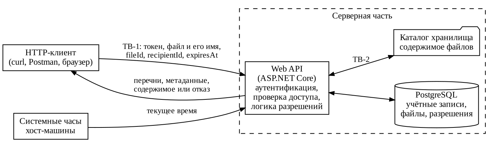

# Модель угроз

## Модель продукта

Клиент обращается только к Web API. Web API определяет пользователя по токену, проверяет право на операцию, читает и меняет записи в PostgreSQL, пишет и читает содержимое в каталоге хранилища. Действует ли разрешение, решает Web API, сравнивая момент окончания срока с текущим временем хост-машины.

Точки входа (маршруты условные):

- `POST /auth/register`, `POST /auth/login` – регистрация и вход;
- `POST /files` – загрузка файла (содержимое, имя, тип, размер);
- `GET /files`, `GET /files/{fileId}` – перечень своих файлов и метаданные;
- `GET /files/{fileId}/content` – скачивание;
- `POST /files/{fileId}/permissions` – выдача разрешения (`recipientId`, `expiresAt`);
- `GET /files/{fileId}/permissions` – перечень получателей;
- `DELETE /files/{fileId}/permissions/{recipientId}` – отзыв;
- `GET /shared` – файлы, доступные получателю.

**Что уже существует:** паспорт продукта и требования безопасности. Серверная часть пока не реализована.

**Что пока планируется:** все компоненты схемы. Первым – Web API с PostgreSQL, регистрацией, входом, загрузкой и скачиванием собственного файла (раздел 9 `PROJECT.md`), затем разрешения, сроки и отзыв.

**Существенные допущения:**

- запуск локальный, сеть между клиентом и сервером вне модели;
- доступ к хост-машине, Docker и каталогу хранилища есть только у команды;
- системные часы хост-машины корректны, время хранится и сравнивается в UTC;
- идентификаторы файлов и пользователей не секретны, защита на их непредсказуемости не строится.

## Границы доверия

| Граница | Что пересекает | Почему требуется проверка |
| --- | --- | --- |
| TB-1. HTTP-клиент => Web API | токен, содержимое и имя файла, `fileId`, `recipientId`, `expiresAt` | все значения формирует клиент и может отправить любой запрос напрямую в обход Swagger. Сервер сам определяет пользователя и сам решает, допустима ли операция |
| TB-2. Web API => каталог хранилища | путь к объекту, содержимое файла | имя файла приходит от клиента через TB-1. Если оно участвует в построении пути, клиент управляет тем, куда пишет сервер |

## Значимые объекты и свойства

Объекты и последствия нарушения – раздел 5 `PROJECT.md`. Защищаются конфиденциальность содержимого, метаданных и перечня получателей, целостность разрешений (получатель, срок, отзыв) и привязки файла к владельцу, подлинность пользователя.

## Угрозы

| ID | Сценарий угрозы | Что нарушается | Граница / точка входа | Связанные SR | Приоритет и обоснование |
| --- | --- | --- | --- | --- | --- |
| T-01 | Аутентифицированный пользователь без разрешения подставляет чужой `fileId` в запрос скачивания. Если сервер проверяет только наличие токена и существование файла, содержимое уходит постороннему | конфиденциальность содержимого | TB-1, `GET /files/{fileId}/content` | SR-01 | высокий, приоритетный набор. Основной сценарий 2, вход полностью под контролем клиента, переданное содержимое не вернуть |
| T-02 | Получатель повторяет запрос скачивания после окончания срока или после отзыва и получает содержимое. Так происходит, если доступ проверяется по полю состояния, которое фоновая задача Quartz.NET меняет раз в интервал, или если срок проверяется только в `GET /shared` | решение владельца о сроке и отзыве, конфиденциальность содержимого | TB-1, `GET /files/{fileId}/content` | SR-01 | высокий, приоритетный набор. Ограниченный срок – основная логика продукта, для нарушения достаточно повторить запрос |
| T-03 | Получатель или любой пользователь выдаёт разрешение на чужой файл себе или третьему лицу, продлевает себе истекший доступ новым разрешением или отзывает разрешения других получателей. Проходит, если сервер не сверяет владельца файла с текущим пользователем | полномочия владельца, целостность разрешений | TB-1, `POST` и `DELETE /files/{fileId}/permissions` | SR-02, SR-04 | высокий, приоритетный набор. Одним запросом даёт постоянный доступ к любому файлу, сценарии 1 и 3 |
| T-04 | Ключ подписи JWT записан в `appsettings.json` и попадает в публичный репозиторий. Посторонний подписывает им токен с идентификатором другого пользователя и действует от его имени. Тот же результат, если сервер не проверяет подпись и срок токена | подлинность пользователя и все его полномочия | TB-1, заголовок `Authorization` | SR-04 | высокий, приоритетный набор. Репозиторий публичный по требованиям курса, одна утечка обходит все проверки |
| T-05 | Пользователь загружает файл с именем вида `../../appsettings.json`. Если путь строится из имени файла, запись уходит за пределы каталога. При совпадении имён двух загрузок (`report.pdf`) второй файл перезаписывает первый, и получатели первого скачивают чужой файл | целостность содержимого и его связи с записью файла | TB-1 => TB-2, `POST /files` | SR-06 | высокий, приоритетный набор. Подмену получатель заметить не может, совпадение имён возникает и без злоумышленника |
| T-06 | Продление срока – необязательная функция (раздел 8 `PROJECT.md`). Без него владелец, чтобы продлить срок, выдаёт тому же получателю второе разрешение. Отзыв меняет состояние одной записи, вторая остаётся действующей, и получатель продолжает скачивать. Угроза возникает из двух корректных запросов | состояние отозвано | TB-1, `POST`, затем `DELETE /files/{fileId}/permissions` | SR-01 | средний. Нужен определённый порядок действий владельца, закрывается тем же способом определения действующего разрешения, что T-02 |
| T-07 | Получатель запрашивает перечень получателей файла и видит других получателей и их сроки. Пользователь без разрешения запрашивает метаданные чужого файла и узнаёт имя и размер | конфиденциальность метаданных и перечня получателей | TB-1, `GET /files/{fileId}`, `GET /files/{fileId}/permissions` | SR-03 | средний. Содержимое не раскрывается, но видно, чем и с кем делится владелец |
| T-08 | Владелец передаёт `expiresAt` без часового пояса, имея в виду московское время. Сервер принимает значение как UTC, и доступ длится на три часа дольше | целостность срока разрешения | TB-1, `POST /files/{fileId}/permissions` | SR-05 | средний. Злоумышленник не нужен, ущерб ограничен часами |
| T-09 | Посторонний перебирает пароли к чужой учётной записи через вход без ограничения попыток. Если пароли хранятся открыто или быстрым хешем без соли, копия таблицы учётных записей раскрывает пароли всех пользователей | подлинность пользователя, конфиденциальность учётных данных | TB-1, `POST /auth/login` | SR-07 | средний. При локальном запуске перебор медленный и заметен, но захват учётной записи даёт все права её владельца |

## Приоритетный набор

T-01, T-02, T-03, T-04, T-05. Каждая ведёт к передаче содержимого тому, кому владелец его не передавал, или к доступу сверх его решения о сроке – это необратимые последствия из раздела 5 `PROJECT.md`. Каждая достижима одним запросом обычного пользователя или с помощью публичного репозитория.

## Пограничный случай для T-02

**Исходное предположение.** Фоновая задача Quartz.NET (раздел 9 `PROJECT.md`) по расписанию переводит разрешения с прошедшим сроком в состояние истекло, проверка доступа пропускает только разрешения в состоянии действует. Цепочка T-02 => SR-01 выглядела выполненной, проверка – запустить задачу, затем запросить содержимое и получить отказ.

**Когда не выполняется.** Задача срабатывает раз в 5 минут. Срок истёк в 12:00:30, следующий запуск в 12:05:00, всё это время получатель скачивает файл. Проверка при этом проходит, потому что сама запускает задачу перед запросом, то есть подтверждает работу задачи, а не свойство SR-01.

**Последствия.** Критерий приёмки SR-01 уточнён – отказ наступает при первом запросе после окончания срока без запуска фоновых задач, файл пропадает из перечня доступных получателю. Это совпадает со сценарием 2 `PROJECT.md`, где записи разрешений не меняются, а меняется результат определения действующего разрешения. Решение для T-02 должно вычислять действующее разрешение в момент запроса по `expiresAt` и признаку отзыва, состояние от фоновой задачи основанием для доступа не служит. Будущая проверка – при подменённом времени разрешение до 12:00:00 даёт доступ в 11:59:59 и отказ в 12:00:00 без запуска фоновой задачи.
